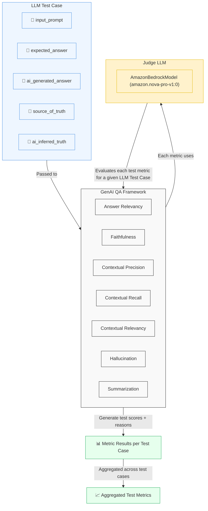

# 🤖 GenAI Output Validation

### 💡 Problem

You've built/evaluating your **own custom LLM** (due to data privacy or confidentiality reasons), or you want to evaluate the performance of a new **LLM of your interest** against a **mature LLM** such as **ChatGPT**, **Gemini**, **LLaMA**, etc.

**Validating AI output** means measuring how accurate, relevant, or reliable an **AI-generated response** is for a given input prompt (from your LLM of interest), compared to a reference or ideal answer.

Using a `JudgeLLM` (a **mature LLM** that is widely accepted, such as ChatGPT, Gemini, LLaMA, etc.) allows you to automate this evaluation.

---

### 📊 About Quantitative Validation

**Quantitative validation** includes:
- 🔍 **Comparison** against a reference or ground-truth answer.  
- 🧮 **Scoring** AI-generated outputs based on measurable quality metrics.  
- 📈 **Aggregation** of scores to produce an overall performance rating.  
- 🧠 **Reasoned Justification** explaining why a particular score or judgment was given.

---

### ⚙️🛠️ Solution



---

### 🧩 LLM Test Case Structure

Each test case contains the following fields:

| **Key**               | **Type** | **Required** | **Description** |
|------------------------|-----------|---------------|------------------|
| `input_prompt`         | `str`     | ✅ | The question or instruction given to the AI model. |
| `expected_answer`      | `str`     | ✅ | The correct or reference answer (ground truth). |
| `ai_generated_answer`  | `str`     | ✅ | The actual response produced by the AI model. |
| `test_case_group`      | `str`     | ❌ | Optional logical grouping (e.g., “General Knowledge”, “Math”, “Geography”). Defaults to `"default"`. |
| `test_case_name`       | `str`     | ❌ | Optional unique name for the test case. Defaults to the `input_prompt` value. |
| `background_context`   | `str`     | ❌ | Optional textual context or reference document supporting the expected answer. If not provided, it is auto-generated as a combination of `input_prompt` and `expected_answer`. |
| `ai_inferred_context`  | `str`     | ❌ | Optional textual context inferred from the AI’s reasoning. If not provided, it is auto-generated as a combination of `input_prompt` and `ai_generated_answer`. |


---

### 🧮 **GenAI Test Metrics**

All metrics produce a score between **0.0** and **1.0**, where **1.0** 🎯 indicates perfect alignment with the evaluation goal.  
Each metric includes a **💬 Reason** to explain the score — showing what the AI did well ✅ or where it failed ❌.

#### 1️⃣ 💬 **Answer Relevancy**
- **🎯 Purpose:** Measures how relevant the AI-generated answer is to the original input prompt.  
- **📊 Scoring:** `0.0 – 1.0`  
- **🧠 Reason:** Explains whether the output directly addresses the user query.  
  🔻 Low scores = off-topic or partially relevant answers.

#### 2️⃣ 📚 **Faithfulness**
- **🎯 Purpose:** Assesses whether the AI output is factually correct ✅ relative to the source/reference.  
- **📊 Scoring:** `0.0 – 1.0`  
- **🔍 Reason:** Highlights factual errors ❌ or unsupported claims.  
  💯 High scores = answer faithfully reflects expected content.

#### 3️⃣ 🎯 **Contextual Precision**
- **🎯 Purpose:** Measures the proportion of relevant content in the AI output compared to all content generated.  
- **📊 Scoring:** `0.0 – 1.0`  
- **🔎 Reason:** Indicates if irrelevant or extra content was produced.  
  ⚠️ Low precision = unnecessary or inaccurate info included.

#### 4️⃣ 📈 **Contextual Recall**
- **🎯 Purpose:** Measures how much of the expected information is actually present in the AI output.  
- **📊 Scoring:** `0.0 – 1.0`  
- **🧾 Reason:** Explains which key points were missing.  
  🚀 High recall = most expected content covered.

#### 5️⃣ 🔗 **Contextual Relevancy**
- **🎯 Purpose:** Combines **Precision** 🎯 and **Recall** 📈 to evaluate how relevant and complete the content is in context.  
- **📊 Scoring:** `0.0 – 1.0`  
- **🧩 Reason:** Highlights missing or irrelevant pieces, giving a holistic view 🌍 of content quality.

#### 6️⃣ 🚫 **Hallucination**
- **🎯 Purpose:** Detects whether the AI produced fabricated 🌀 or unsupported content.  
- **📊 Scoring:** `0.0 – 1.0`  
- **🔍 Reason:** High score ✅ = no hallucinations;  
  Low score ❌ = identifies speculative or false content.

#### 7️⃣ 📝 **Summarization**
- **🎯 Purpose:** Evaluates how well the AI output summarizes 📚 the provided context or expected answer.  
- **📊 Scoring:** `0.0 – 1.0`  
- **🧠 Reason:** Indicates whether key points were retained ✨ or lost, and if the summary is concise and coherent 💬.

---

## 🧩 Pre-requisites
- 🐍 Install **Python3**  
- ☁️ Ensure you have an **AWS account** and valid **AWS credentials** 🔑  
- ⚙️ Configure your `AWS credentials` to your default AWS profile using `aws configure` command inside the `$HOME/.aws` folder 📂.

## 🚀 How to Run

```
python3 -m venv llm-testing-venv
source llm-testing-venv/bin/activate
pip install -r requirements.txt
python main.py
```

## 📝 Notes
🧠 AWS is not a mandatory requirement to run `deepeval` test cases.
It is ONLY listed as a pre-requisite here since `Amazon-Nova-Pro` is being used as the `JudgeLLM` for this demo (see `modules/judge_llm.py`)


You can choose **any trusted LLM** 🤖 as your `JudgeLLM` from the following list in the `deepeval` library:
```
https://github.com/confident-ai/deepeval/tree/main/deepeval/models/llms
```
🧠 The available options for choosing a `JudgeLLM` (as per the above link) includes:
- 💬 OpenAI
- 🔍 Deepseek
- 🌐 Gemini
- ☁️ AWS
- 🔷 Azure
- 🧠 Ollama
- ➕ and more...

💡 You can even **create your own custom** `JudgeLLM` 🧩 by extending the class: 
`deepeval.models.DeepEvalBaseModel` 🧱
